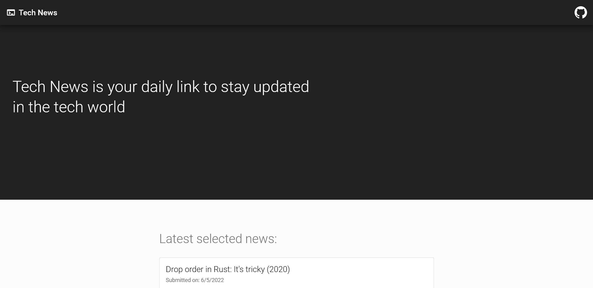
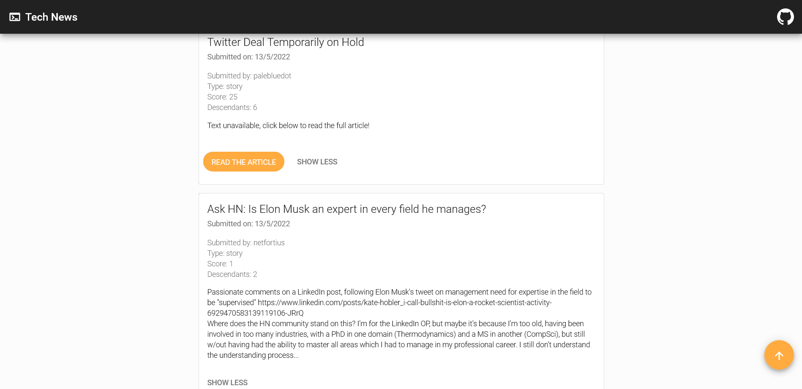

# Progetto Angular 2 per Start2Impact

## Descrizione

Questo progetto sviluppato in Angular permette di visualizzare le ultime news pubblicate su [Hacker News](https://news.ycombinator.com/).

Al caricamento iniziale, l'app effettua due chiamate api: con una ottiene degli ID sulle ultime notizie e una seconda ritorna le informazioni dei primi dieci, mostrando il tutto a schermo. Un bottone posto in fondo alla pagina permette poi di effettuare una nuova chiamata per gli articoli successivi, sempre in gruppo da dieci.

Esteticamente l'app segue il Material Design di Google ed è stata pensata per essere fruita principalmente da mobile. Ho aggiunto un bottone "scroll to top" poiché la lista può diventare lunga.

## Metodologie di sviluppo

Sotto src/app troviamo **components**, **interfaces** e **services**.

I componenti si preoccupano di generare l'interfaccia e alcuni si scambiano dati attraverso i decorator @Input().

L'interfaccia _News_ viene utilizzata per ottenere correttamente i dati asincroni delle notizie.

In ultimo, il servizio _News Service_ si preoccupa delle chiamate api. Questo fa uso degli Observable messi a disposizione da Angular. Un primo Observable ritorna semplicemente un array di ID, mentre un secondo si preoccupa di raccogliere le info relative agli ID ottenuti e di ritornare il tutto seguendo le spefiche dell'interfaccia. Come loro, tutte le variabili dell'app sono state tipizzate per evitare errori.

Al termine del ciclo di vita del componente "dashboard", che alla creazione si sottoscrive a suddetti Observable, le sottoscrizioni vengono sciolte per evitare leak.

Il deploy è stato effettuato su Firebase.

## Link

[Link per provare l'app](https://s2i-technewsapp.web.app/)

### Costruito con

- Angular
- Material Design
- Firebase

### Screenshots

## Istruzioni per provare l'app in locale

Per provare l'app in locale è necessario avere innanzitutto gli strumenti di Angular da riga di comando, che si possono installare con `npm install -g @angular/cli`.

A questo punto si può clonare il progetto, soddisfare le dependencies di npm ed utilizzare i comandi di seguito riportati.

### Dev server

Eseguire `ng serve -o` per avviare il dev server. Di default sarà avviato su `http://localhost:4200/`. Ad ogni salvataggio il sito si ricarica in automatico.

### Build

Eseguire `ng build` per compilare il progetto. Il risultato verrà inserito nella cartella `dist/`.

### Unit tests

Eseguire `ng test` per eseguire degli unit test con [Karma](https://karma-runner.github.io). Di base questo avviene con Chrome, ma il progetto è già stato configurato per essere testato anche con Edge e Firefox attraverso le flag `--browsers Edge|Firefox`. Per qualsiasi altro browser cercare relativi plugin.

### End-to-end tests

Eseguire `ng e2e` per avviare dei test end-to-end con una piattaforma a tua scelta. Per usare questo comando è necessario installare prima un pacchetto per abilitare le funzionalità end-to-end.
